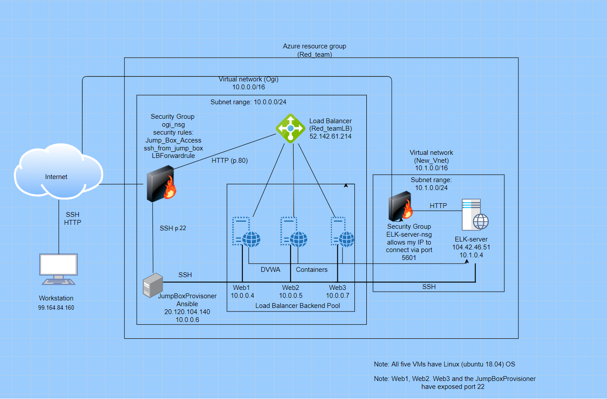

# Project 1 ELK Stack Deployment
Repository for Linux scripts, Ansible YAML scripts, Network diagrams
## Automated ELK Stack Deployment

The files in this repository were used to configure the network depicted below.

These files have been tested and used to generate a live ELK deployment on Azure. They can be used to either recreate the entire deployment pictured above. Alternatively, select portions of the playbook file may be used to install only certain pieces of it, such as Filebeat.

  - _[filebeat-playbook.yml](https://github.com/Ogichka/Project-1-ELK-Stack-Deployment-/blob/main/Ansible/filebeat-playbook.yml)_

This document contains the following details:
- Description of the Topology
- Access Policies
- ELK Configuration
  - Beats in Use
  - Machines Being Monitored
- How to Use the Ansible Build

### Description of the Topology

The main purpose of this network is to expose a load-balanced and monitored instance of DVWA, the D*mn Vulnerable Web Application.

Load balancing ensures that the application will be highly available and reliable, in addition to restricting unnecessary traffic to the network.
- _A load balancer defends an organization against distributed denial-of-service (DDoS) attacks. A Jump box is the only machine with the access to outside network. The Jump box acts as an audit for traffic and a single point where we can manage user accounts._ 

Integrating an ELK server allows users to easily monitor the vulnerable VMs for changes to the data and system logs.
- _Filebeat monitors and collects data about the file system. It monitors the log files or locations that we specify, collects log events, and then forwards them to either Elaticsearch or Logstash._
- _Metricbeat takes the metrics and statistics that it collects and ships them to the output that we specify, such as Elasticsearch or Logstash._

The configuration details of each machine may be found below.

| Name       | Function  | IP Address     | Operating System |
|------------|-----------|----------------|------------------|
| Jump Box   | Gateway   | 10.0.0.6       | Linux            |
| Web1       | webserver | 10.0.0.4       | Linux            |
| Web2       | webserver | 10.0.0.5       | Linux            |
| Web3       | webserver | 10.0.0.7       | Linux            |
| ELK-server | ELK Stack | 10.1.0.4       | Linux            |

### Access Policies

The machines on the internal network are not exposed to the public Internet. 

Only the Jump Box machine can accept connections from the Internet. Access to this machine is only allowed from the following IP addresses:
- _99.164.84.160   (My personal machine public IP address)_

Machines within the network can only be accessed by the Jump Box VM.
- _The Jump Box has access to ELK VM. The IP address of the Jump Box is 10.0.0.6_
- _My personal machine with IP address 99.164.84.160 has access to ELK-server via port 5601._

A summary of the access policies in place can be found in the table below.

| Name       | Publicly Accessible | Allowed IP Addresses        |
|------------|---------------------|-----------------------------|
| Jump Box   | No                  | 99.164.84.160               |
| Web1       | No                  | 10.0.0.6                    | 
| Web2       | No                  | 10.0.0.6                    |
| Web3       | No                  | 10.0.0.6                    |
| ELK-server | No                  | 10.0.0.6 and 99.164.84.160  |

### Elk Configuration

Ansible was used to automate configuration of the ELK machine. No configuration was performed manually, which is advantageous because Ansible is designed to be very simple, reliable, and consistent for configuration management. Ansible also lets us quickly and easily deploy multitier apps and it is agentless wich means we don't need to insatll any other software. 

The playbook implements the following tasks:
- Install docker.io
- Install python3-pip
- Install Docker module
- Increase virtual memory
- Use more memory
- download and launch a docker elk container
- Enable service docker on boot

The following screenshot displays the result of running `docker ps` after successfully configuring the ELK instance. 

### Target Machines & Beats
This ELK server is configured to monitor the following machines:
- _Web1 10.0.0.4_
- _Web2 10.0.0.5_
- _Web3 10.0.0.7_

We have installed the following Beats on these machines:
- _Filebeats_
- _Metricbeats_

These Beats allow us to collect the following information from each machine:
- _Filebeats collect data about the file system, such as log events which enables analysts to monitor files for suspicious changes._
- _Metricbeats collect machine metrics, such as uptime and CPU usage._

### Using the Playbook
In order to use the playbook, you will need to have an Ansible control node already configured. Assuming you have such a control node provisioned: 

SSH into the control node and follow the steps below:
- Copy the [install-elk.yml](https://github.com/Ogichka/Project-1-ELK-Stack-Deployment-/blob/main/Ansible/install-elk.yml) file to /etc/ansible.
- Update the [hosts](https://github.com/Ogichka/Project-1-ELK-Stack-Deployment-/blob/main/Ansible/hosts.txt) file to include ELK hosts and then add the machine IP address, followed by ansible_python_interpreter=/usr/bin/python3. Filebeat should be installed on the web servers that are accepting traffic which then send that data to the ELK server. 
- Run the playbook, and navigate to http://[your.VM.IP]:5601/app/kibana to check that the installation worked as expected.

### Additional commands:

- sudo docker start container_name    > to start the container
- sudo docker container list -a       > to see the container's name
- sudo docker attach container_name   > to get a shell on the Ansible container
- cd /etc/ansible                     > to change directory into ansible
- ansible-playbook playbook_name.yml  > to run the playbook
- sudo docker run                     > to create and run a new container
- sudo docker ps -a                   > to list all active/inactive containers
- ssh-keygen                          > to create a ssh key
- ansible -m ping all                 > to check the connection of ansible containers 
- ansible -m ping all                 > to check the connection of ansible containers 

